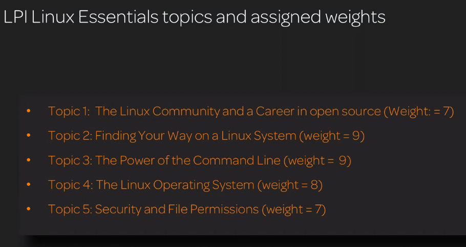

# LPI Linux Essential

- LPI: Linux Professional Institute
    - Its Non-profit Org.
    - Vendor-Neutral
    - Certified Linux professional in over 180 countries.
- The current version is: 010-150(version 1.5).
- Each ovjective on the exam has a specific weight.
- **_The higher the weight the more questions you can expect_**.
- Consisted of 40 questions and one-hour time frame.

Requirements:

- Basic working knowledge of computer hardware.
- An understanding of operating system components,programs that ar used on the computer, and process that run within the computing environment.
- Knowledge of varios open source application that can ve used in the workplace, and their relation to their closed source counterparts(...).
- How to navigate the Linux Desktop Environment.
- The ability to work from the command line to manipulate files and folders.

LPI Linux Essentials topics and assigned weights:
;

